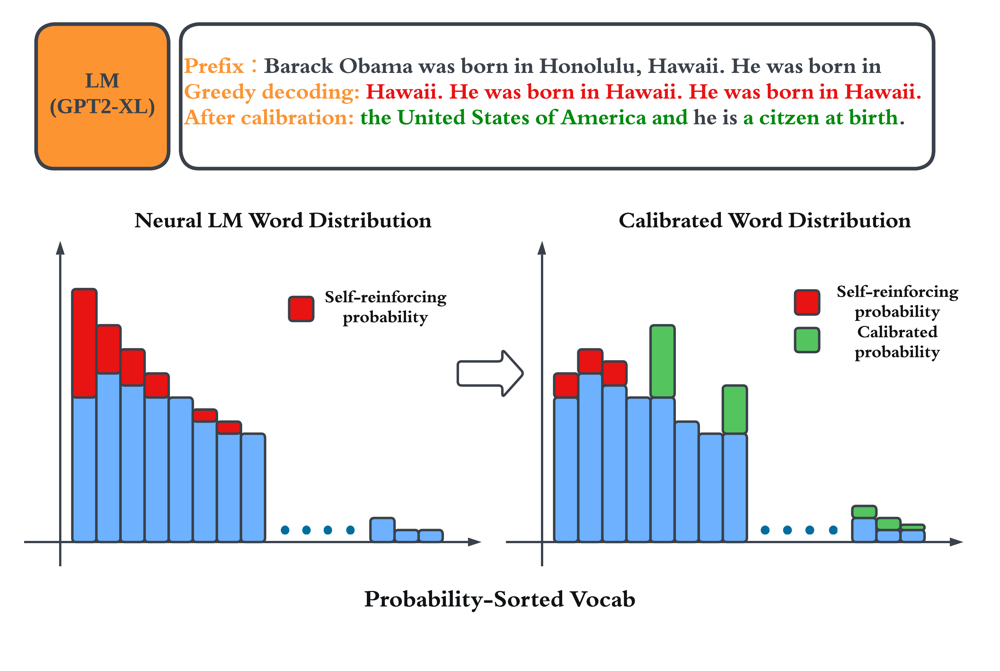

## Penalty Decoding: Well Suppress the Self-Reinforcement Effect in Open-Ended Text Generation

### Our Insight



### Reproduction 

```bash
pip install requirements.txt
```

#### SR_Analyze

```bash
cd SR_ANALYZE
bash config.sh
```

#### penalty decoding

